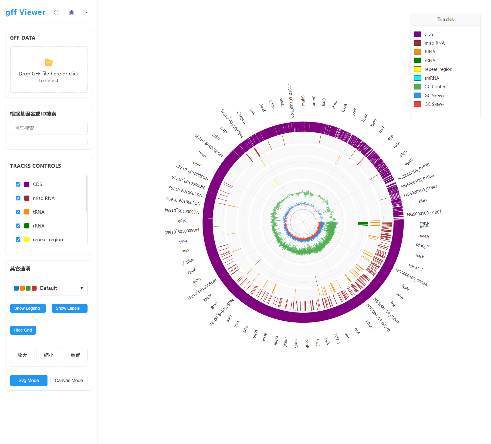
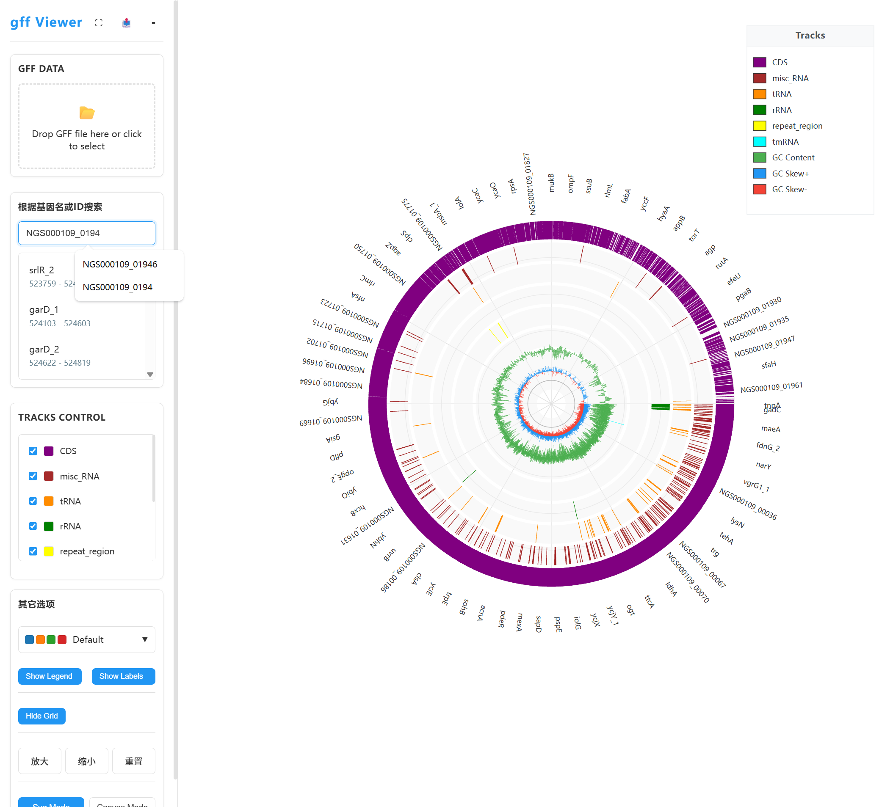
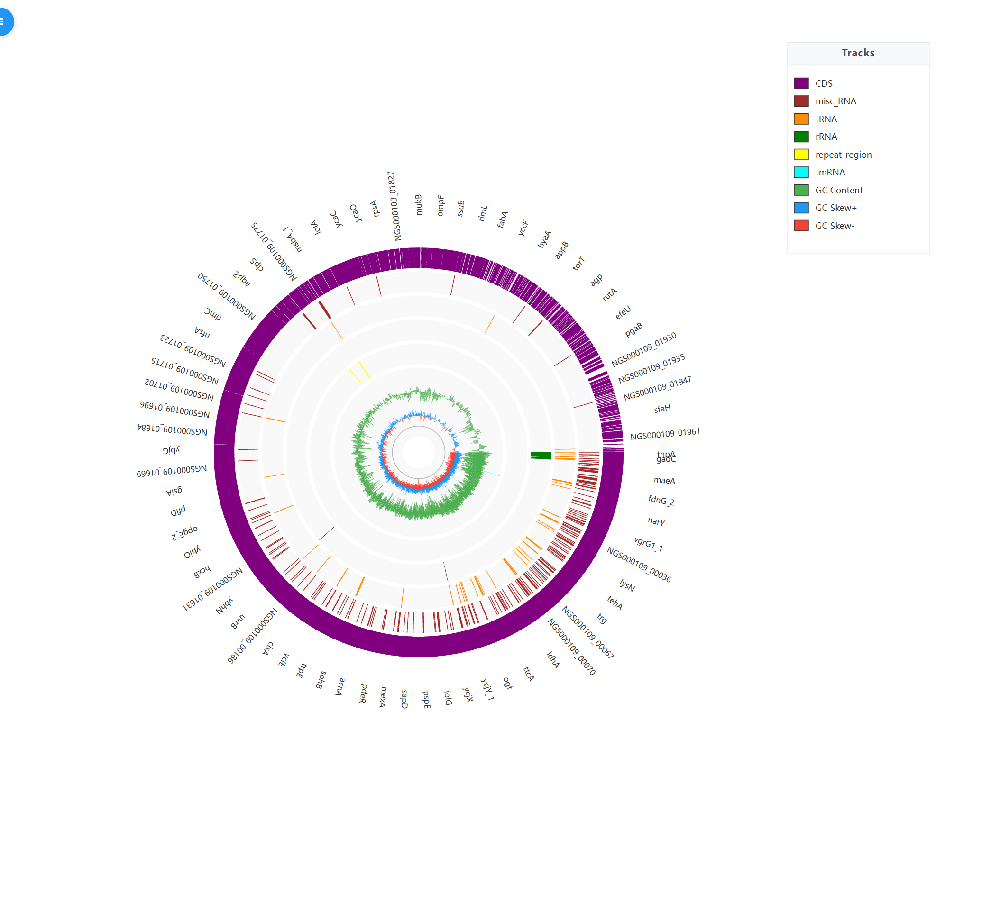

# gff Viewer - 生物基因组可视化引擎

## 项目背景

gff Viewer 是一个企业级、高性能的生物基因组可视化引擎，旨在提供直观、交互式的基因组数据可视化解决方案。它学习了 CGView.js 的设计理念，专注于为生物信息学研究人员和开发者提供强大、灵活的基因组可视化工具。

随着基因组学研究的快速发展，对基因组数据的可视化需求日益增长。iView 应运而生，它不仅提供了传统的环形和线性视图，还支持多种数据类型的展示，如基因、RNA、重复区域、GC含量和GC偏斜等，为研究人员提供了全面的基因组数据洞察能力。

## 主要功能

- **多种视图模式**：支持环形视图和线性视图，满足不同场景的可视化需求
- **高性能渲染**：同时支持 Canvas (通过 PIXI.js) 和 SVG (通过 d3.js) 渲染模式
- **交互式操作**：支持鼠标拖拽、滚轮缩放、点击选择等交互方式
- **多轨道展示**：可以同时展示多个轨道的基因组特征，包括基因、RNA、重复区域等
- **特殊轨道支持**：内置支持 GC 含量和 GC 偏斜等特殊轨道的可视化
- **颜色方案**：内置多种颜色方案，支持自定义配色
- **图例控制**：可显示/隐藏图例，优化视图空间
- **标签控制**：可显示/隐藏标签，减少视觉干扰，支持标签碰撞检测
- **响应式布局**：支持窗口大小调整，自适应不同屏幕尺寸
- **工具栏管理**：左侧工具栏可收起/展开，优化空间利用
- **数据导入**：支持 GFF3 格式的基因组数据导入
- **主题管理**：支持明暗主题切换
- **工具提示**：提供交互式工具提示，增强用户体验
- **轨道管理**：可控制各轨道的显示/隐藏状态
- **基因搜索**：支持按基因名称或ID搜索基因，并在圈图中高亮显示
- **参考圆线控制**：可显示/隐藏圈图参考圆线，优化视图效果

## 项目预览

### 环形视图



### 基因搜索功能



### 参考圆线控制



## 技术栈

- **前端框架**：TypeScript + JavaScript
- **可视化库**：
  - PIXI.js (用于高性能 Canvas 渲染)
  - d3.js (用于 SVG 渲染)
- **构建工具**：Vite
- **样式**：原生 CSS
- **数据格式**：GFF3

## 运行方式

### 前提条件

- Node.js 16.0 或更高版本
- npm 或 yarn 包管理器

### 安装步骤

1. **克隆项目**

```bash
git clone <repository-url>
cd iview
```

2. **安装依赖**

```bash
# 使用 npm
npm install

# 或使用 yarn
yarn install
```

3. **启动开发服务器**

```bash
# 使用 npm
npm run dev

# 或使用 yarn
yarn dev
```

4. **构建生产版本**

```bash
# 使用 npm
npm run build

# 或使用 yarn
yarn build
```

### 示例数据

项目包含一个 `demo.gff` 文件作为示例数据，启动开发服务器后会自动加载该数据进行展示。

## 项目结构

```
iview/
├── src/                 # 源代码目录
│   ├── core/            # 核心功能实现
│   │   ├── renderer/    # 渲染器实现
│   │   │   ├── circular/ # 环形视图渲染器
│   │   │   └── base.ts    # 基础渲染器类
│   │   ├── utils/       # 工具函数
│   │   └── index.ts     # 核心类定义
│   ├── ui/              # UI 相关代码
│   │   ├── Sidebar/     # 侧边栏管理
│   │   ├── templates/   # HTML 模板
│   │   ├── ThemeManager.ts      # 主题管理
│   │   ├── ColorSchemeManager.ts # 颜色方案管理
│   │   ├── ControlsManager.ts   # 控件管理
│   │   ├── TooltipManager.ts    # 工具提示管理
│   │   └── DragAndZoomManager.ts # 拖拽和缩放管理
│   ├── main.ts          # 主入口文件
│   └── style.css        # 样式文件
├── public/              # 静态资源
│   └── demo.gff         # 示例数据
├── index.html           # HTML 入口
├── package.json         # 项目配置
├── tsconfig.json        # TypeScript 配置
├── vite.config.ts       # Vite 配置
├── LICENSE              # MIT 许可证
└── README.md            # 项目说明
```

## 使用指南

### 基本使用

1. **加载基因组数据**：系统会自动加载 `demo.gff` 文件作为示例数据
2. **切换视图模式**：可以在环形视图和线性视图之间切换
3. **缩放操作**：使用鼠标滚轮或工具栏的缩放按钮进行缩放
4. **平移操作**：按住鼠标左键并拖动进行平移
5. **控制显示**：使用工具栏控制图例、标签和参考圆线的显示/隐藏
6. **颜色方案**：从下拉菜单中选择不同的颜色方案
7. **轨道管理**：通过侧边栏控制各个轨道的显示/隐藏状态
8. **基因搜索**：在侧边栏的搜索框中输入基因名称或ID，按回车键进行搜索，搜索结果会在圈图中高亮显示
9. **主题切换**：在设置中切换明暗主题

### 自定义数据

要使用自己的基因组数据，只需将 GFF3 格式的文件替换 `public/demo.gff` 文件，然后重新启动开发服务器即可。

## 高级功能

### 标签渲染

- **智能标签布局**：自动计算标签位置，确保标签不重叠
- **统一朝外显示**：标签始终朝向基因组环的外侧，提高可读性
- **LOD 优化**：根据缩放级别动态调整标签显示数量，优化性能

### 轨道管理

- **动态轨道高度**：根据轨道数量自动调整轨道高度
- **特殊轨道支持**：专门针对 GC 含量和 GC 偏斜轨道进行优化渲染
- **轨道可见性控制**：可单独控制每个轨道的显示状态

### 渲染优化

- **双渲染引擎**：同时支持 Canvas 和 SVG 渲染，适应不同场景需求
- **碰撞检测**：避免标签和其他元素重叠，提高可视化效果
- **响应式设计**：自动适应不同屏幕尺寸和窗口大小变化

## 许可证

本项目采用 MIT 许可证，详情请参阅 [LICENSE](LICENSE) 文件。

## 贡献

欢迎社区贡献代码、报告问题或提出建议。请通过 GitHub 仓库的 Issues 和 Pull Requests 进行贡献。

## 联系方式

如有任何问题或建议，请通过 GitHub 仓库的 Issues 与我们联系。
