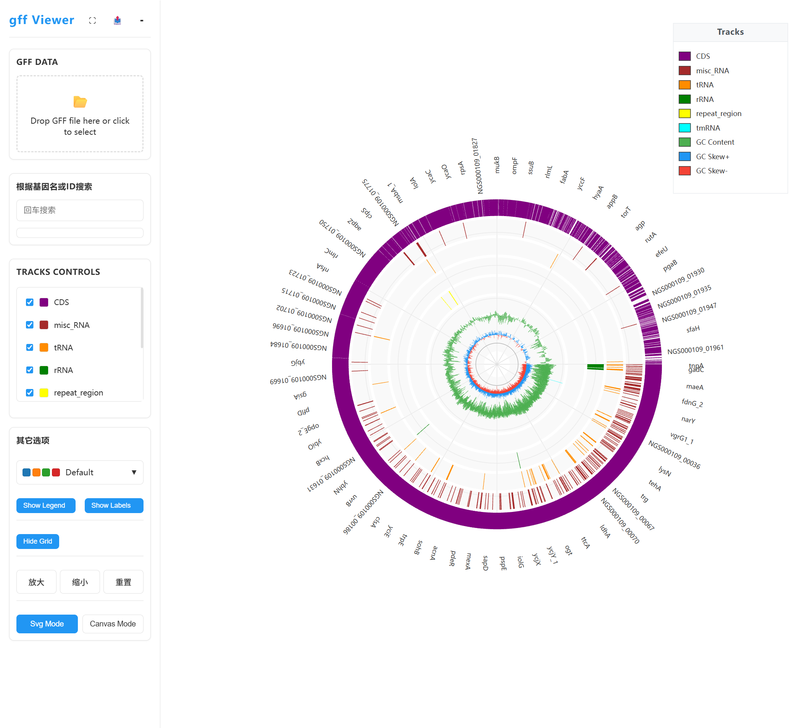
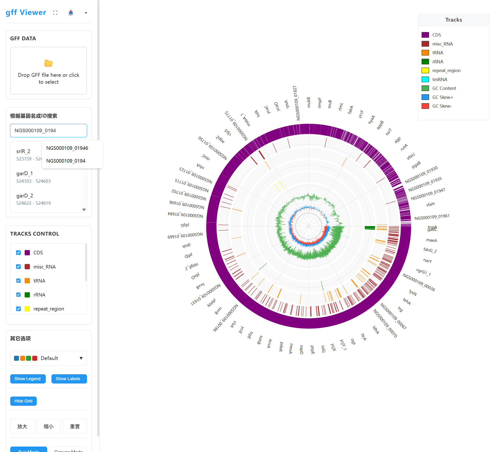
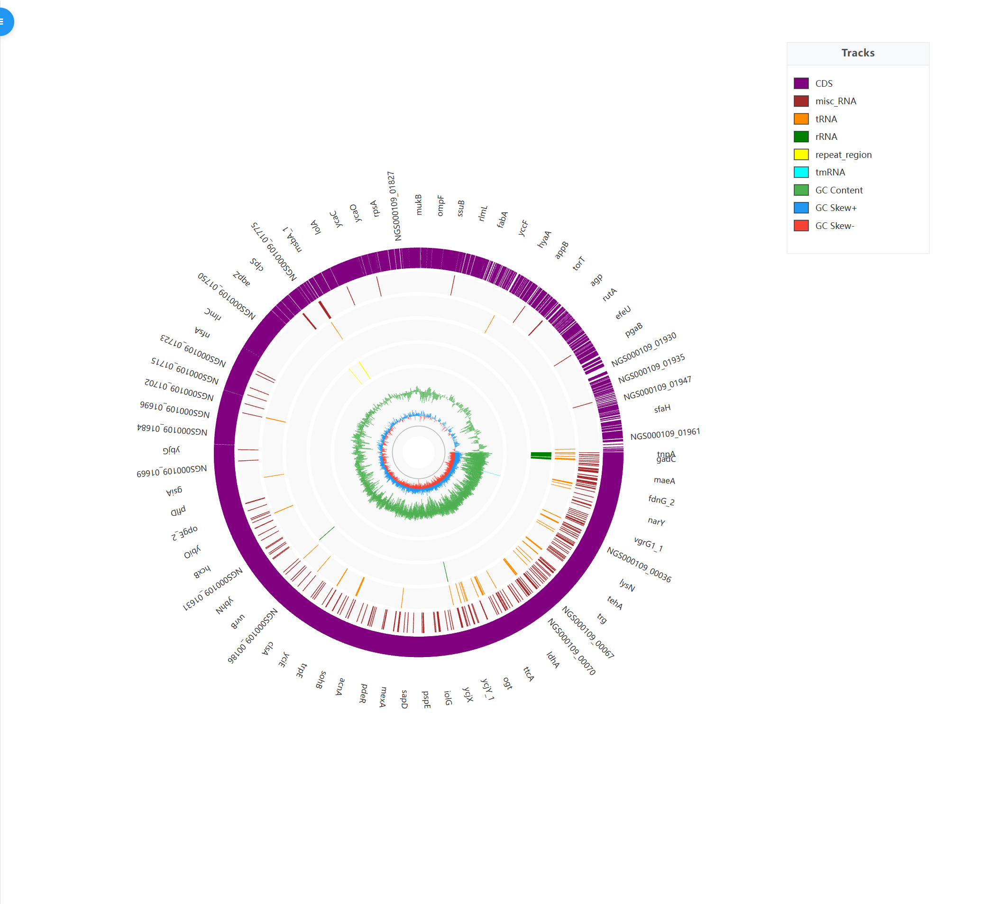

# gff Viewer - 生物基因组可视化引擎

> ⚠️ **警告**: 本项目目前处于研发阶段，功能可能不稳定，请勿用于生产环境。

## 项目背景

gff Viewer 是一个企业级、高性能的生物基因组可视化引擎，旨在提供直观、交互式的基因组数据可视化解决方案。它学习了 CGView.js 的设计理念，专注于为生物信息学研究人员和开发者提供强大、灵活的基因组可视化工具。

随着基因组学研究的快速发展，对基因组数据的可视化需求日益增长。iView 应运而生，它不仅提供了传统的环形和线性视图，还支持多种数据类型的展示，如基因、RNA、重复区域、GC含量和GC偏斜等，为研究人员提供了全面的基因组数据洞察能力。

## 主要功能

- **多种视图模式**：支持环形视图和线性视图，满足不同场景的可视化需求
- **高性能渲染**：同时支持 Canvas (通过 PIXI.js) 和 SVG (通过 d3.js) 渲染模式
- **交互式操作**：支持鼠标拖拽、滚轮缩放、点击选择等交互方式
- **多轨道展示**：可以同时展示多个轨道的基因组特征，包括基因、RNA、重复区域等
- **特殊轨道支持**：内置支持 GC 含量和 GC 偏斜等特殊轨道的可视化
- **颜色方案**：内置多种颜色方案，支持自定义配色
- **图例控制**：可显示/隐藏图例，优化视图空间
- **标签控制**：可显示/隐藏标签，减少视觉干扰，支持标签碰撞检测
- **响应式布局**：支持窗口大小调整，自适应不同屏幕尺寸
- **工具栏管理**：左侧工具栏可收起/展开，优化空间利用
- **数据导入**：支持 GFF3 格式的基因组数据导入
- **主题管理**：支持明暗主题切换
- **工具提示**：提供交互式工具提示，增强用户体验
- **轨道管理**：可控制各轨道的显示/隐藏状态
- **基因搜索**：支持按基因名称或ID搜索基因，并在圈图中高亮显示
- **参考圆线控制**：可显示/隐藏圈图参考圆线，优化视图效果

## 项目预览

### 环形视图



### 基因搜索功能



### 参考圆线控制



## 技术栈

- **前端框架**：TypeScript + JavaScript
- **可视化库**：
  - PIXI.js (用于高性能 Canvas 渲染)
  - d3.js (用于 SVG 渲染)
- **构建工具**：Vite
- **样式**：原生 CSS
- **数据格式**：GFF3

## 运行方式

### 前提条件

- Node.js 16.0 或更高版本
- npm 或 yarn 包管理器

### 安装步骤

1. **克隆项目**

```bash
git clone https://github.com/XiaoshengSu/gffviewer.git
cd gffviewer
```

2. **安装依赖**

```bash
# 使用 npm
npm install

# 或使用 yarn
yarn install
```

3. **启动开发服务器**

```bash
# 使用 npm
npm run dev

# 或使用 yarn
yarn dev
```

4. **构建生产版本**

```bash
# 使用 npm
npm run build

# 或使用 yarn
yarn build
```

### 示例数据

项目包含一个 `demo.gff` 文件作为示例数据，启动开发服务器后会自动加载该数据进行展示。

## 项目结构

```
iview/
├── src/                 # 源代码目录
│   ├── core/            # 核心功能实现
│   │   ├── renderer/    # 渲染器实现
│   │   │   ├── circular/ # 环形视图渲染器
│   │   │   └── base.ts    # 基础渲染器类
│   │   ├── utils/       # 工具函数
│   │   └── index.ts     # 核心类定义
│   ├── ui/              # UI 相关代码
│   │   ├── Sidebar/     # 侧边栏管理
│   │   ├── templates/   # HTML 模板
│   │   ├── ThemeManager.ts      # 主题管理
│   │   ├── ColorSchemeManager.ts # 颜色方案管理
│   │   ├── ControlsManager.ts   # 控件管理
│   │   ├── TooltipManager.ts    # 工具提示管理
│   │   └── DragAndZoomManager.ts # 拖拽和缩放管理
│   ├── main.ts          # 主入口文件
│   └── style.css        # 样式文件
├── public/              # 静态资源
│   └── demo.gff         # 示例数据
├── index.html           # HTML 入口
├── package.json         # 项目配置
├── tsconfig.json        # TypeScript 配置
├── vite.config.ts       # Vite 配置
├── LICENSE              # MIT 许可证
└── README.md            # 项目说明
```

## 使用指南

### 基本使用

1. **加载基因组数据**：系统会自动加载 `demo.gff` 文件作为示例数据
2. **切换视图模式**：可以在环形视图和线性视图之间切换
3. **缩放操作**：使用鼠标滚轮或工具栏的缩放按钮进行缩放
4. **平移操作**：按住鼠标左键并拖动进行平移
5. **控制显示**：使用工具栏控制图例、标签和参考圆线的显示/隐藏
6. **颜色方案**：从下拉菜单中选择不同的颜色方案
7. **轨道管理**：通过侧边栏控制各个轨道的显示/隐藏状态
8. **基因搜索**：在侧边栏的搜索框中输入基因名称或ID，按回车键进行搜索，搜索结果会在圈图中高亮显示
9. **主题切换**：在设置中切换明暗主题

### 自定义数据

要使用自己的基因组数据，只需将 GFF3 格式的文件替换 `public/demo.gff` 文件，然后重新启动开发服务器即可。

## 高级功能

### 标签渲染

- **智能标签布局**：自动计算标签位置，确保标签不重叠
- **统一朝外显示**：标签始终朝向基因组环的外侧，提高可读性
- **LOD 优化**：根据缩放级别动态调整标签显示数量，优化性能

### 轨道管理

- **动态轨道高度**：根据轨道数量自动调整轨道高度
- **特殊轨道支持**：专门针对 GC 含量和 GC 偏斜轨道进行优化渲染
- **轨道可见性控制**：可单独控制每个轨道的显示状态

### 渲染优化

- **双渲染引擎**：同时支持 Canvas 和 SVG 渲染，适应不同场景需求
- **碰撞检测**：避免标签和其他元素重叠，提高可视化效果
- **响应式设计**：自动适应不同屏幕尺寸和窗口大小变化

## 许可证

本项目采用 MIT 许可证，详情请参阅 [LICENSE](LICENSE) 文件。

## 贡献

欢迎社区贡献代码、报告问题或提出建议。请通过 GitHub 仓库的 Issues 和 Pull Requests 进行贡献。

## 作为 NPM 模块使用

### 安装

```bash
# 使用 npm
npm install gffviewer

# 或使用 yarn
yarn add gffviewer
```

### 基本使用

```javascript
import { CGView } from 'gffviewer';

// 创建容器元素
const container = document.getElementById('gffviewer-container');

// 初始化 CGView
const cgview = new CGView(container, {
  width: 800,
  height: 600,
  theme: 'light',
  defaultViewMode: 'circular',
  showSidebar: true,
  showLegend: true,
  showToolbar: true,
  zoomEnabled: true,
  panEnabled: true,
  searchEnabled: true,
  rendererType: 'canvas'
});

// 加载基因组数据
async function loadData() {
  try {
    const response = await fetch('path/to/your/data.gff');
    const content = await response.text();
    await cgview.loadGenome(content, 'gff3');
    console.log('Genome data loaded successfully');
  } catch (error) {
    console.error('Error loading genome data:', error);
  }
}

// 加载数据
loadData();
```

### 核心 API

#### 初始化

```javascript
const cgview = new CGView(container, options);
```

- `container`: HTMLElement - 放置可视化的容器元素
- `options`: CGViewOptions - 配置选项

#### 加载数据

```javascript
await cgview.loadGenome(data, format);
```

- `data`: string | File - 基因组数据，可以是字符串或文件对象
- `format`: string - 数据格式，目前支持 'gff3'

#### 视图控制

```javascript
// 缩放
cgview.zoomIn();
cgview.zoomOut();
cgview.setZoomLevel(2); // 2x 缩放

// 平移
cgview.pan(deltaX, deltaY);

// 重置视图
cgview.resetView();

// 切换图例
cgview.toggleLegend(true); // 显示图例

// 切换标签
cgview.toggleLabels(true); // 显示标签

// 切换参考圆线
cgview.toggleGrid(true); // 显示参考圆线
```

#### 导出功能

```javascript
// 导出为 PNG
const pngBlob = await cgview.export('png');
downloadBlob(pngBlob, 'genome.png');

// 导出为 SVG
const svgBlob = await cgview.export('svg');
downloadBlob(svgBlob, 'genome.svg');

function downloadBlob(blob, filename) {
  const url = URL.createObjectURL(blob);
  const a = document.createElement('a');
  a.href = url;
  a.download = filename;
  document.body.appendChild(a);
  a.click();
  document.body.removeChild(a);
  URL.revokeObjectURL(url);
}
```

#### 事件监听

```javascript
// 监听数据加载完成事件
cgview.on('dataLoaded', (genome) => {
  console.log('Genome data loaded:', genome);
});

// 监听缩放事件
cgview.on('zoom', (data) => {
  console.log('Zoom event:', data);
});

// 监听平移事件
cgview.on('pan', (data) => {
  console.log('Pan event:', data);
});

// 监听点击事件
cgview.on('click', (data) => {
  console.log('Click event:', data);
});

// 监听悬停事件
cgview.on('hover', (data) => {
  console.log('Hover event:', data);
});
```

## 配置选项详解

### 初始化选项

| 选项 | 类型 | 默认值 | 描述 |
|------|------|--------|------|
| `width` | number | 800 | 可视化区域宽度 |
| `height` | number | 600 | 可视化区域高度 |
| `theme` | string | 'light' | 主题，支持 'light' 和 'dark' |
| `defaultViewMode` | string | 'circular' | 默认视图模式，目前仅支持 'circular' |
| `showSidebar` | boolean | true | 是否显示侧边栏 |
| `showLegend` | boolean | true | 是否显示图例 |
| `showToolbar` | boolean | true | 是否显示工具栏 |
| `zoomEnabled` | boolean | true | 是否启用缩放功能 |
| `panEnabled` | boolean | true | 是否启用平移功能 |
| `searchEnabled` | boolean | true | 是否启用搜索功能 |
| `rendererType` | string | 'canvas' | 渲染类型，支持 'canvas' 和 'svg' |

### 示例：自定义配置

```javascript
const cgview = new CGView(container, {
  width: 1000,
  height: 800,
  theme: 'dark',
  defaultViewMode: 'circular',
  showSidebar: false, // 不显示侧边栏
  showLegend: true,
  showToolbar: true,
  zoomEnabled: true,
  panEnabled: true,
  searchEnabled: false, // 禁用搜索功能
  rendererType: 'svg' // 使用 SVG 渲染
});
```

## 高级使用场景

### 1. 处理大型基因组数据

对于大型基因组数据，可以通过以下方式优化性能：

```javascript
// 初始化时设置更合理的配置
const cgview = new CGView(container, {
  width: 1000,
  height: 800,
  rendererType: 'canvas', // Canvas 渲染更适合大型数据
  // 其他配置...
});

// 加载数据时使用流式处理
async function loadLargeGenome() {
  try {
    // 显示加载状态
    container.innerHTML = '<div style="display: flex; align-items: center; justify-content: center; height: 100%; font-size: 18px; color: #666;">Loading large genome data...</div>';
    
    // 加载数据
    const response = await fetch('large-genome.gff');
    const content = await response.text();
    
    // 加载到 CGView
    await cgview.loadGenome(content, 'gff3');
    
    console.log('Large genome data loaded successfully');
  } catch (error) {
    console.error('Error loading large genome data:', error);
    container.innerHTML = '<div style="display: flex; align-items: center; justify-content: center; height: 100%; font-size: 18px; color: #f44336;">Error loading data</div>';
  }
}

loadLargeGenome();
```

### 2. 自定义颜色方案

```javascript
// 导入颜色方案管理器
import { ColorSchemeManager } from 'gffviewer';

// 创建颜色方案管理器实例
const colorSchemeManager = new ColorSchemeManager();

// 应用内置颜色方案
colorSchemeManager.applyColorScheme('default');
colorSchemeManager.applyColorScheme('viridis');
colorSchemeManager.applyColorScheme('categorical');

// 自定义颜色方案
const customColorScheme = {
  gene: '#3498db',
  rna: '#e74c3c',
  repeat: '#9b59b6',
  gc_content: '#2ecc71',
  gc_skew_plus: '#1abc9c',
  gc_skew_minus: '#f39c12'
};

// 应用自定义颜色方案
colorSchemeManager.setCustomColorScheme(customColorScheme);
colorSchemeManager.applyColorScheme('custom');
```

### 3. 与框架集成

#### React 集成示例

```jsx
import React, { useEffect, useRef } from 'react';
import { CGView } from 'gffviewer';

const GenomeViewer = ({ dataUrl }) => {
  const containerRef = useRef(null);
  const cgviewRef = useRef(null);

  useEffect(() => {
    if (containerRef.current && !cgviewRef.current) {
      // 初始化 CGView
      cgviewRef.current = new CGView(containerRef.current, {
        width: 800,
        height: 600,
        theme: 'light',
        defaultViewMode: 'circular',
        showSidebar: true,
        showLegend: true,
        showToolbar: true,
        zoomEnabled: true,
        panEnabled: true,
        searchEnabled: true,
        rendererType: 'canvas'
      });

      // 加载数据
      const loadData = async () => {
        try {
          const response = await fetch(dataUrl);
          const content = await response.text();
          await cgviewRef.current.loadGenome(content, 'gff3');
        } catch (error) {
          console.error('Error loading genome data:', error);
        }
      };

      loadData();
    }

    // 清理函数
    return () => {
      if (cgviewRef.current) {
        cgviewRef.current.destroy();
        cgviewRef.current = null;
      }
    };
  }, [dataUrl]);

  return (
    <div
      ref={containerRef}
      style={{
        width: '100%',
        height: '600px',
        border: '1px solid #e0e0e0',
        borderRadius: '4px'
      }}
    />
  );
};

export default GenomeViewer;
```

#### Vue 集成示例

```vue
<template>
  <div ref="container" class="genome-viewer"></div>
</template>

<script setup>
import { ref, onMounted, onUnmounted } from 'vue';
import { CGView } from 'gffviewer';

const props = defineProps({
  dataUrl: {
    type: String,
    required: true
  }
});

const container = ref(null);
let cgview = null;

onMounted(async () => {
  if (container.value) {
    // 初始化 CGView
    cgview = new CGView(container.value, {
      width: 800,
      height: 600,
      theme: 'light',
      defaultViewMode: 'circular',
      showSidebar: true,
      showLegend: true,
      showToolbar: true,
      zoomEnabled: true,
      panEnabled: true,
      searchEnabled: true,
      rendererType: 'canvas'
    });

    // 加载数据
    try {
      const response = await fetch(props.dataUrl);
      const content = await response.text();
      await cgview.loadGenome(content, 'gff3');
    } catch (error) {
      console.error('Error loading genome data:', error);
    }
  }
});

onUnmounted(() => {
  if (cgview) {
    cgview.destroy();
    cgview = null;
  }
});
</script>

<style scoped>
.genome-viewer {
  width: 100%;
  height: 600px;
  border: 1px solid #e0e0e0;
  border-radius: 4px;
}
</style>
```

## 常见问题与解决方案

### 1. 数据加载失败

**问题**：加载 GFF3 文件时出现错误。

**解决方案**：
- 检查文件格式是否正确，确保是有效的 GFF3 格式
- 检查文件路径是否正确
- 检查文件大小是否过大，对于大型文件可能需要优化加载方式
- 查看浏览器控制台的错误信息，了解具体错误原因

### 2. 性能问题

**问题**：渲染大型基因组数据时性能较差。

**解决方案**：
- 使用 Canvas 渲染模式（`rendererType: 'canvas'`）
- 减少标签显示数量（通过缩放或配置）
- 关闭不必要的功能（如搜索、图例等）
- 考虑对大型数据进行分块处理

### 3. 样式问题

**问题**：可视化区域大小不正确或样式异常。

**解决方案**：
- 确保容器元素有明确的宽度和高度
- 检查 CSS 样式是否与其他样式冲突
- 尝试使用不同的渲染模式

### 4. 导出功能问题

**问题**：导出 PNG 或 SVG 时出现错误。

**解决方案**：
- 确保浏览器支持 Canvas 或 SVG 导出
- 检查渲染器类型是否正确
- 对于大型可视化，可能需要增加导出超时时间

## 性能优化建议

1. **选择合适的渲染器**：
   - 对于大型数据或需要高性能的场景，使用 Canvas 渲染器
   - 对于需要更好的文本渲染或与 DOM 交互的场景，使用 SVG 渲染器

2. **优化数据加载**：
   - 对于大型 GFF3 文件，考虑使用流式解析
   - 实现数据缓存机制，避免重复加载

3. **优化渲染**：
   - 减少不必要的渲染操作
   - 使用 LOD (Level of Detail) 技术，根据缩放级别调整渲染细节
   - 避免频繁的 DOM 操作

4. **内存管理**：
   - 及时清理不再使用的资源
   - 使用 `destroy()` 方法释放 CGView 实例占用的资源

## 最佳实践

1. **数据预处理**：
   - 在加载前对 GFF3 文件进行验证和预处理
   - 对于大型数据，考虑过滤掉不必要的信息

2. **配置优化**：
   - 根据具体使用场景调整配置选项
   - 对于嵌入式应用，考虑关闭不必要的 UI 元素

3. **错误处理**：
   - 实现完善的错误处理机制
   - 提供友好的错误提示

4. **用户体验**：
   - 提供加载状态指示
   - 实现平滑的过渡动画
   - 确保交互操作响应及时

## 扩展与定制

### 自定义渲染器

如果需要自定义渲染逻辑，可以扩展现有的渲染器类：

```javascript
import { CircularRenderer } from 'gffviewer';

class CustomCircularRenderer extends CircularRenderer {
  // 重写渲染方法
  render() {
    // 自定义渲染逻辑
    super.render();
    // 额外的渲染操作
  }
  
  // 添加自定义方法
  customMethod() {
    // 自定义功能
  }
}

// 使用自定义渲染器
const customRenderer = new CustomCircularRenderer(container, width, height, 'canvas');
```

### 自定义数据解析器

如果需要支持其他数据格式，可以实现自定义数据解析器：

```javascript
import { DataManager } from 'gffviewer';

// 扩展 DataManager 类
class CustomDataManager extends DataManager {
  // 重写加载方法
  async loadGenome(data, format) {
    if (format === 'custom') {
      // 自定义格式解析逻辑
      return this.parseCustomFormat(data);
    }
    // 调用父类方法处理其他格式
    return super.loadGenome(data, format);
  }
  
  // 自定义解析方法
  parseCustomFormat(data) {
    // 实现自定义格式解析
    // ...
  }
}
```

## 联系方式

如有任何问题或建议，请通过 GitHub 仓库的 Issues 与我们联系。
